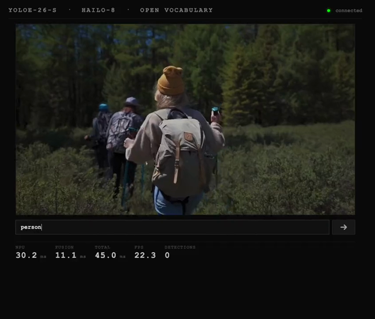

---
hide:
  - navigation
  - toc
---

  <h1 class="demo-title">Demos</h1>
  
Real-time computer vision on edge hardware.

<a href="open-vocab/" class="demo-card">
  New
  
  
    <strong class="demo-card-title">Open-Vocabulary Detection x Hailo-8</strong>
    Type any text query, get real-time detections. No retraining, no recompilation.
    ~24 FPS on Raspberry Pi 5
  
</a>

<a href="yolo26/" class="demo-card">
  
  
    <strong class="demo-card-title">YOLO26 x Hailo-8L</strong>
    First port of YOLO26 to Hailo-8L, before official SDK support.
    30 FPS on Raspberry Pi 5
  
</a>

