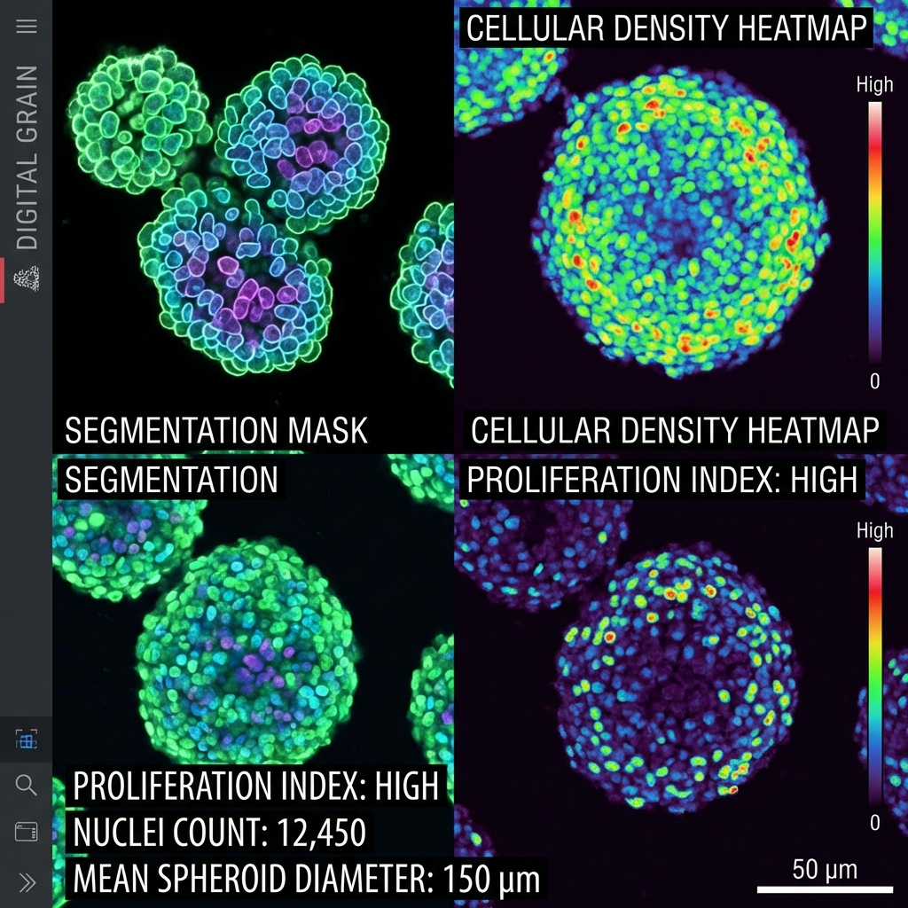

---
hide:
  - navigation
  - toc
---

# Applied Researcher & High-Performance Software Engineer

12 years of experience bridging the gap between deep learning research and bare-metal execution. Specializing in computer vision optimization for edge hardware and low-latency C++ inference engines.

M.Sc. Computer Science, TAU
Matzov Alumnus
Specializing in C++, Python, & Edge AI Implementation

### Model Optimization & Training
Custom architecture design, training and fine-tuning for specific business KPIs and accuracy targets under hardware constraints.

### High-Performance Engineering
Systematic profiling and optimization of inference pipelines. Focusing on quantization strategies, performance-accuracy tradeoffs, and efficient C++ implementations for edge hardware.

### The Outcome
Production-ready vision systems that don't compromise between speed and precision. **Real-time performance on edge devices.**

## Featured Case Studies

<a href="case-studies/yolo26n-hailo-L8/" class="case-study-card">
    
    

        <h3>Porting YOLO26n to the Hailo-8L (85 FPS)</h3>
        
Achieving a 13.7x speedup on Raspberry Pi 5 by moving a "non-supported" detection head to a templated C++ post-processor.

    

</a>

<a href="case-studies/non-invasive-viability/" class="case-study-card">
    
    

        <h3>Non-Invasive Qualification of Viability in Spheroids</h3>
        
Combining classical CV and deep learning for peer-reviewed biological research.

    

</a>

<a href="case-studies/optimizing-srnn/" class="case-study-card">
    
    

        <h3>Optimizing SRNN (5x Speedup)</h3>
        
Profiling and optimizing the Shuffling Recurrent Neural Network (SRNN) using Custom CUDA kernels and PyTorch to achieve 5x faster training.

    

</a>

## Need to unblock your edge AI pipeline?

I help companies squeeze every possible FLOP out of their hardware while maintaining the accuracy their business goals require. Whether you're stuck on a compiler error or an accuracy gap, let’s solve it.

<a href="contact/" class="cta-button">Get in Touch</a>

