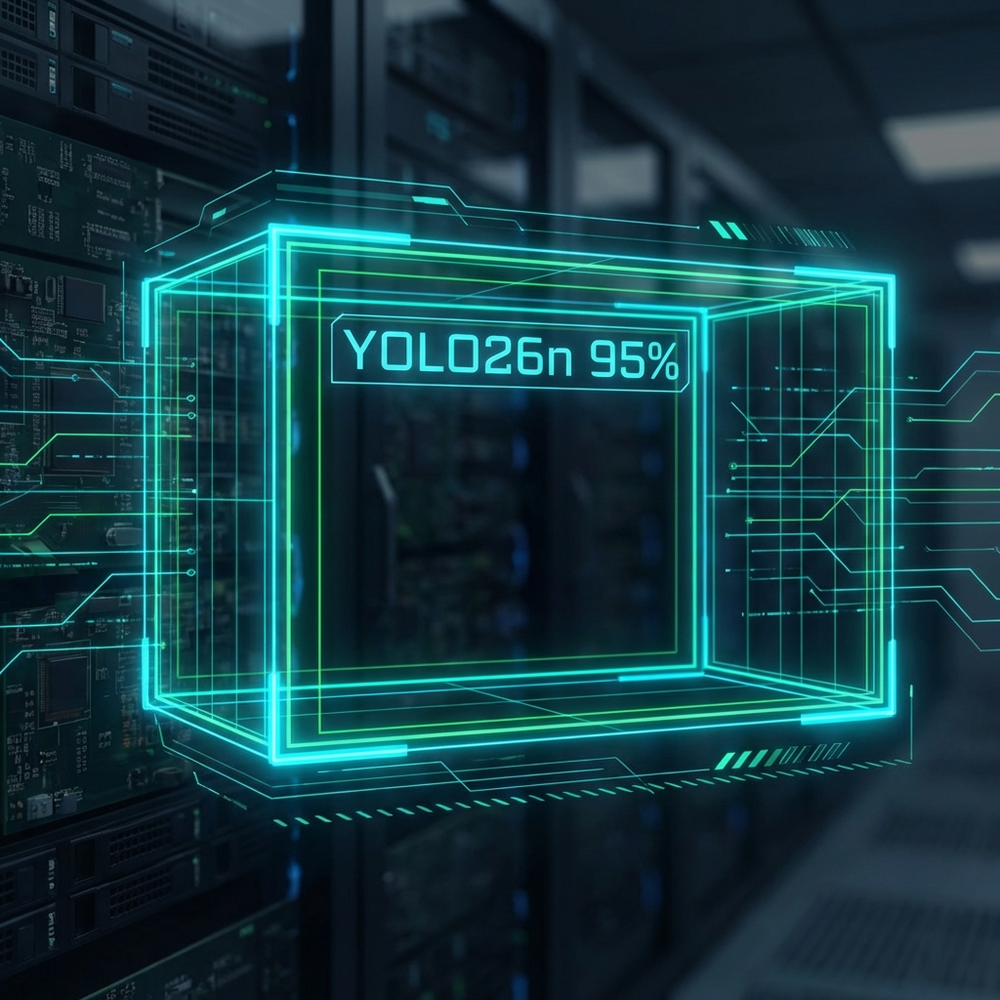
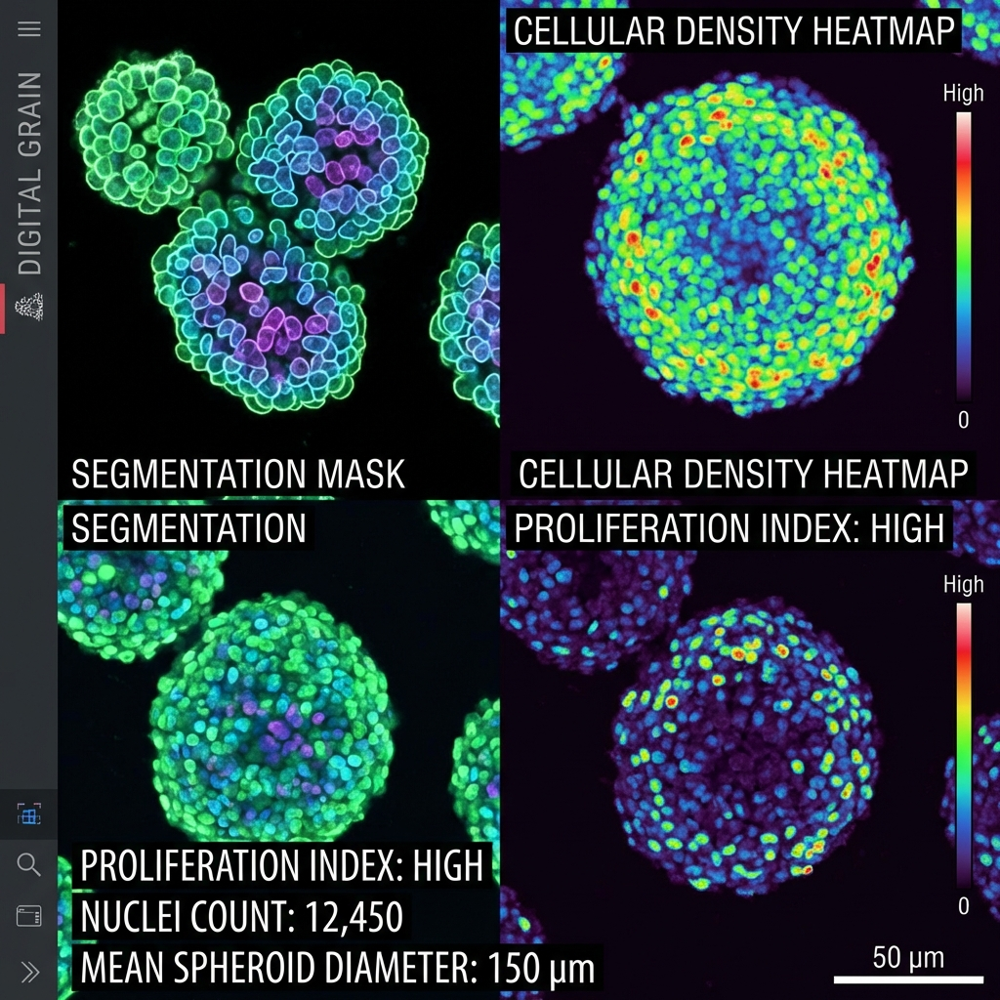

---
hide:
  - navigation
  - toc
---

# Applied Researcher & High-Performance Software Engineer

12 years of experience bridging the gap between deep learning research and bare-metal execution. Specializing in computer vision optimization for edge hardware and low-latency C++ inference engines.

M.Sc. Computer Science, TAU
Matzov Alumnus
Specializing in C++, Python, & Edge AI Implementation

<a href="demos/open-vocab/" class="demo-banner">
  &#9654;
  
    <strong>New: Open-Vocabulary Detection</strong>
    Type any query, get real-time detections on Hailo-8 - ~24 FPS on Raspberry Pi 5
  
</a>

<a href="demos/yolo26/" class="demo-banner demo-banner-secondary">
  &#9654;
  
    <strong>YOLO26 x Hailo-8L</strong>
    Real-time multi-object tracking - 30 FPS on Raspberry Pi 5
  
</a>

### Model Optimization & Training
Custom architecture design, training and fine-tuning for specific business KPIs and accuracy targets under hardware constraints.

### High-Performance Engineering
Systematic profiling and optimization of inference pipelines. Focusing on quantization strategies, performance-accuracy tradeoffs, and efficient C++ implementations for edge hardware.

### The Outcome
Production-ready vision systems that don't compromise between speed and precision. **Real-time performance on edge devices.**

## Featured Case Studies

<a href="case-studies/yolo26-jetson-power-modes/" class="case-study-card">
    
    

        <h3>Jetson Orin Nano 7 W vs 15 W on YOLO26</h3>
        
The silicon idle floor is identical in both modes (2.79 W measured) — 7 W mode only caps the upper bound. For YOLO26 at variants bigger than n, 7 W trades ~50% throughput for ~25% power. Lower watts ≠ better efficiency.

    

</a>

<a href="case-studies/yolo26-jetson-vs-hailo/" class="case-study-card">
    
    

        <h3>YOLO26 on Jetson Orin Nano 8GB vs Hailo-8L (and Hailo-8)</h3>
        
Head-to-head accelerator comparison at 15 W. Jetson FP16 beats Hailo zoo accuracy at every size with no quantization; Hailo-8 wins on small-model throughput; the Jetson INT8 path I tried was Pareto-dominated by FP16.

    

</a>

<a href="case-studies/quantization_noise_analysis_yolo26/" class="case-study-card">
    
    

        <h3>Quantization Noise Analysis: YOLO26 on Hailo-8L</h3>
        
Layer-by-layer SNR analysis explaining why YOLO26-M loses 16% accuracy after INT8 quantization despite having more parameters than the Small variant.

    

</a>

<a href="case-studies/yolo26n-hailo-L8/" class="case-study-card">
    
    

        <h3>Porting YOLO26n to the Hailo-8L (85 FPS)</h3>
        
Achieving a 13.7x speedup on Raspberry Pi 5 by moving a "non-supported" detection head to a templated C++ post-processor.

    

</a>

<a href="case-studies/non-invasive-viability/" class="case-study-card">
    
    

        <h3>Non-Invasive Quantification of Viability in Spheroids</h3>
        
Published in <em>Frontiers in Bioengineering and Biotechnology</em> (2026). Combining classical CV and deep learning to non-invasively predict cell viability.

    

</a>

<a href="case-studies/optimizing-srnn/" class="case-study-card">
    
    

        <h3>Optimizing SRNN (5x Speedup)</h3>
        
Profiling and optimizing the Shuffling Recurrent Neural Network (SRNN) using Custom CUDA kernels and PyTorch to achieve 5x faster training.

    

</a>

## Need to unblock your edge AI pipeline?

I help companies squeeze every possible FLOP out of their hardware while maintaining the accuracy their business goals require. Whether you're stuck on a compiler error or an accuracy gap, let’s solve it.

<a href="contact/" class="cta-button">Get in Touch</a>

